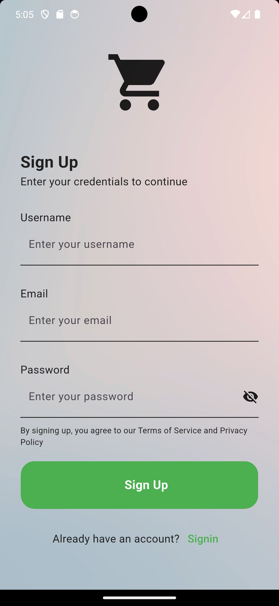
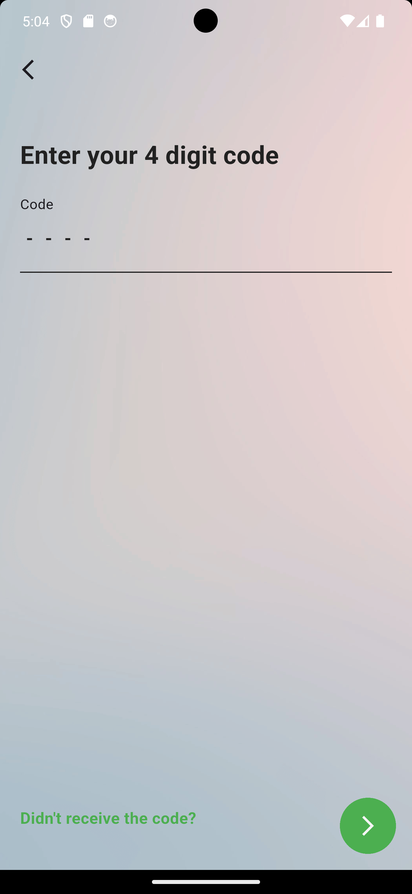
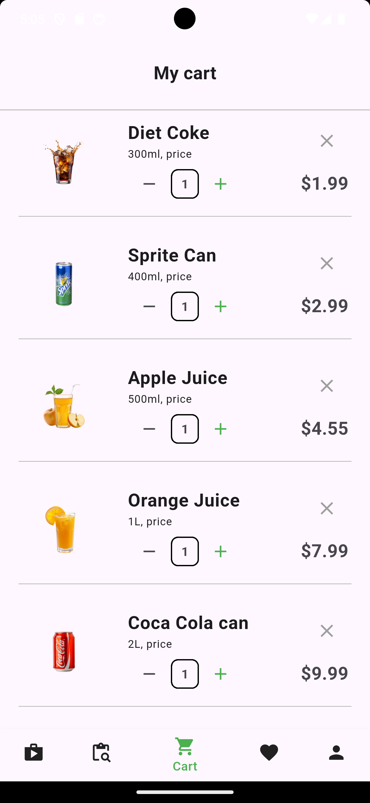

# 🛒 E-commerce App UI - Flutter

A beautifully crafted **E-commerce Flutter App UI** by **Abdesh Singh**, designed to showcase a clean, modern, and user-friendly interface for shopping applications. This project is built entirely using Flutter and is perfect for learning, inspiration, or integration into a real-world app.

---

## 📱 Screens Included

- ✅ Splash Screen  
- ✅ Onboarding  
- ✅ Login & Signup  
- ✅ Home with Categories  
- ✅ Product Details  
- ✅ Cart  
- ✅ Wishlist  
- ✅ User Profile  
- ✅ Settings  
- ✅ Checkout  
- ✅ Search UI
- ✅ Filter
- ✅ category
- ✅ Order complete
- ✅ Order failed

---

## 🖼️ Screenshots

| Splash    | Onboarding |
|-----------|-----------|
|  |  |
| Signin page | Login page |
|-----------|-----------|
|  |  |
| Signup page | Number page |
|-----------|-----------|
|  |  |
| Number verification Page | Location Page |
|-----------|-----------|
|  |  |
| Home Page | Cart Page |
|-----------|-----------|
|  |  |
| Home Page | Cart Page |
|-----------|-----------|
|  |  |
| Home Page | Cart Page |
|-----------|-----------|
|  |  |
| Home Page | Cart Page |
|-----------|-----------|
|  |  |
| Home Page | Cart Page |
|-----------|-----------|
|  |  |

> 📝 Add your actual screenshots to the `screenshots/` folder.

---

## 🚀 Getting Started

To run this Flutter UI on your device:

```bash
# Clone the repository
git clone https://github.com/abdeshsingh/ecommerce_flutter_ui.git
cd ecommerce_flutter_ui

# Get dependencies
flutter pub get

# Run the app
flutter run


